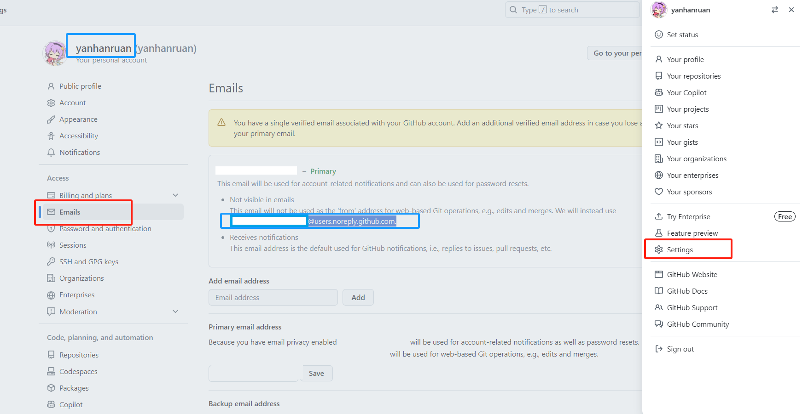
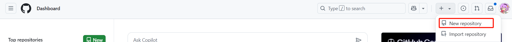
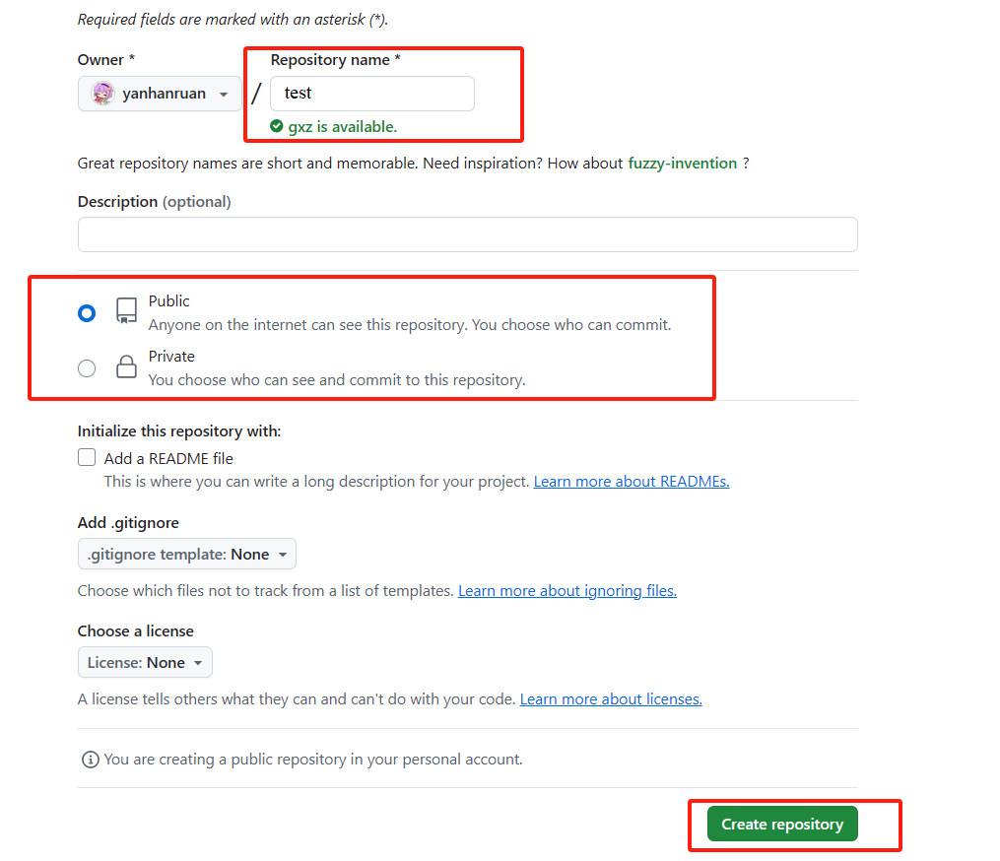
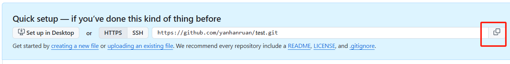
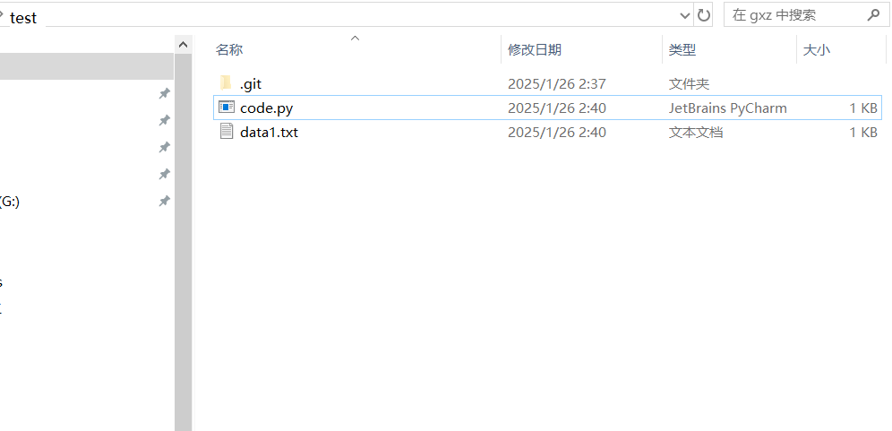
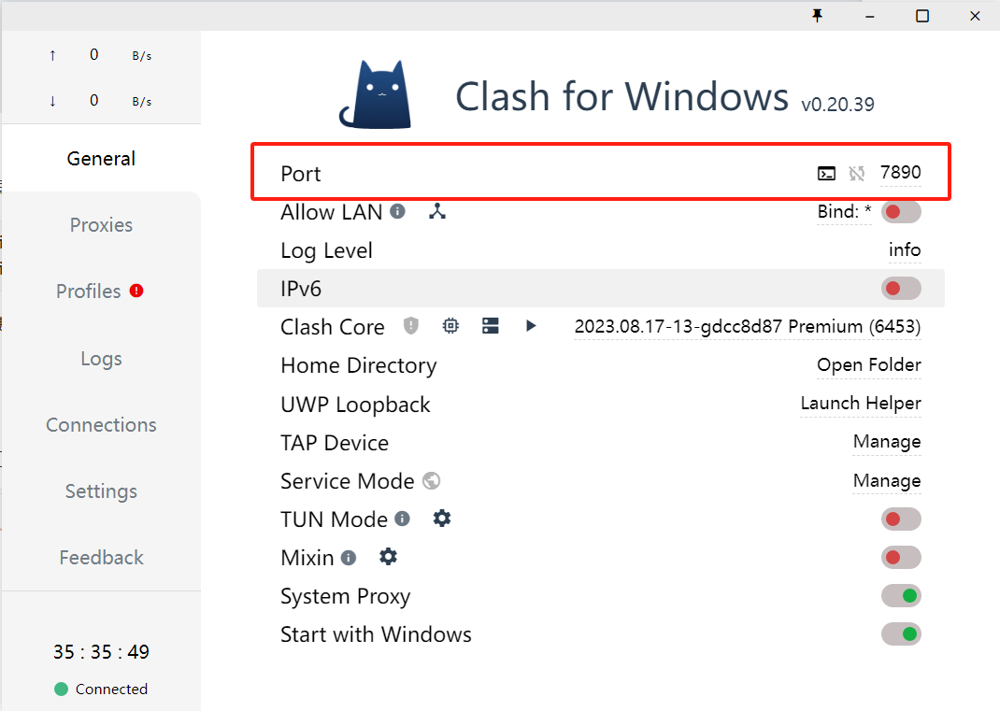
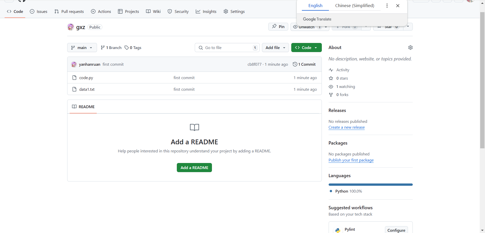

# 安装Git

1. 下载 Git 安装程序
    前往 Git 官方网站：https://git-scm.com/downloads/win ，选择**[64-bit Git for Windows Setup](https://github.com/git-for-windows/git/releases/download/v2.47.1.windows.2/Git-2.47.1.2-64-bit.exe).**

   记得 Add Git to PATH（如果有一定要选）

2. **安装后配置用户名和邮箱：**

   ```bash
   git config --global user.name "你的用户名"
   git config --global user.email "你的邮箱地址"
   ```

   用户名 和 邮箱 在GitHub 上的位置如下图所示

   

3. 安装完成后，可以在命令提示符（CMD）或 PowerShell 中输入以下命令检查是否安装成功：

```
git --version
```

如果返回版本号，则说明安装成功。


# 将你的文件上传到Github 

- 账号申请略

- new repository 新建仓库




------


- 命名、选择是否公开、创建

- 同时请检查你本地的代码大小，GPT推荐限制：不超过 5GB，一般来讲最好控制在100M以下。如果文件太大可能会上传失败。如果发现太大可以考虑添加gitignore，仅保留核心代码和核心结果，具体操作可以问gpt



接下来会有如下页面，选择**Quick setup**，点击复制按钮：



右键任意非文件位置，选择`Open Git Bash here`，输入如下命令（https链接需要替换成你自己的），回车

```
git clone 你的仓库链接
```

于是远程仓库（GitHub）上的文件夹便会克隆下来，关闭上述窗口，检查文件夹，将你需要备份到GitHub上的文件整理到其中，这里用示例文件说明：




在test文件夹下右键选择`Open Git Bash here`，顺序输入如下命令

```
git add .
```

```
git commit -m "first commit"
```

```
git push 
```

在git push 的 过程中，可能会失败，有可能是用户认证、也有可能是代理原因。请根据报错提示进行排查。

如果是用户认证原因，则为git添加本地账户名称以及邮箱即可

例如

```
git config --global user.name "你的用户名"
git config --global user.email "你的邮箱地址"
用户名 和 邮箱 在GitHub 上的位置如下图所示
```


如果是网络原因，那就需要给git配置代理

```
git config --global http.proxy http://代理地址:端口
git config --global https.proxy http://代理地址:端口
```

我使用clash作为代理，其端口在软件首页可以查看：



因此我的git 代理设置为：

http://127.0.0.1:7890 


即可完成首次提交，云端结果如下：




根据上述操作应该可以快速应对你的需求，首次提交即可，可以等后续有时间再来看后面的内容。


# Git 最常用命令（optional）

以下是一份仅包含 **Git 基础操作** 的教程，无分支操作

## **1. 创建和初始化仓库**

1. **新建一个 Git 仓库：** 在一个文件夹中初始化 Git 仓库：

   ```bash
   git init
   ```

2. **克隆远程仓库到本地：** 如果已有远程仓库，使用以下命令将代码克隆到本地：

   ```bash
   git clone 仓库地址
   ```

   示例：

   ```bash
   git clone https://github.com/your-repo.git
   ```

------

## **2. 文件的版本管理流程**

### **2.1 查看仓库状态**

```bash
git status
```

- 显示未跟踪、已修改或已暂存的文件。

------

### **2.2 添加文件到暂存区**

将文件添加到 Git 暂存区（准备提交）：

```bash
git add 文件名
```

或添加所有更改：

```bash
git add .
```

------

### **2.3 提交到本地仓库**

将暂存区的更改提交到本地仓库：

```bash
git commit -m "提交说明"
```

------

### **2.4 查看提交历史**

```bash
git log
```

- 查看所有提交记录。 

------

## **3. 常用命令总结表**

| 操作             | 命令                            |
| ---------------- | ------------------------------- |
| 初始化仓库       | `git init`                      |
| 克隆仓库         | `git clone 仓库地址`            |
| 查看状态         | `git status`                    |
| 添加文件到暂存区 | `git add 文件名` 或 `git add .` |
| 提交到本地仓库   | `git commit -m "提交说明"`      |
| 查看提交历史     | `git log`                       |
| 推送到远程仓库   | `git push`                      |
| 拉取远程代码     | `git pull`                      |

